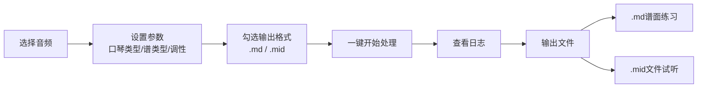

# 口琴谱自动生成工具 - 产品需求文档 (PRD)

**版本**：v1.1  
**状态**：待评审  
**目标用户**：会编程的口琴爱好者  
**核心理念**：输入任意歌曲 → 自动输出可直接使用的口琴谱（文本/MIDI）

---

## 一、项目目标与范围

### 1.1 核心目标
- 将普通音频文件（MP3/WAV）**自动转换**为口琴演奏可用的乐谱
- 支持**十孔布鲁斯口琴**和**半音阶口琴**两种类型
- 输出**Markdown格式文本谱**（遵循`jianpu-spec`规范）和 **MIDI单音轨试听文件**

### 1.2 明确不做（v1.0范围外）
- 不生成五线谱或图形化乐谱（PDF/图片）
- 不做实时录音扒谱
- 不提供移动端App
- 不支持多音轨复杂编曲完整还原（只提取主旋律）

---

## 二、用户操作流程



---

## 三、功能需求详细表

### 3.1 输入模块

| 功能点 | 需求描述 | 优先级 |
| :--- | :--- | :--- |
| 音频格式 | 支持 MP3、WAV 等常见格式 | P0 |
| 文件选择 | GUI提供文件浏览按钮，显示选中文件路径 | P0 |

### 3.2 参数配置模块

| 功能点 | 需求描述 | 优先级 |
| :--- | :--- | :--- |
| 口琴类型 | 单选：十孔布鲁斯口琴 / 半音阶口琴（默认十孔） | P0 |
| 输出谱类型 | 单选：口琴谱（孔号+技巧）/ 简谱（纯数字） | P0 |
| 调性策略 | 单选框组：自动推荐最佳 / 强制使用用户选择的调性 | P0 |
| 目标调性 | 下拉列表包含12个调性（C, C#, D, ..., B），默认C | P1 |
| 输出格式 | **多选框**（可同时勾选）：<br>- [ ] Markdown谱面（.md）<br>- [ ] MIDI试听文件（.mid）<br>默认两者都勾选 | P0 |

### 3.3 处理核心模块

| 功能点 | 需求描述 | 优先级 |
| :--- | :--- | :--- |
| 主旋律分离 | 调用Demucs，提取人声或最高频乐器轨道 | P0 |
| MIDI生成 | 调用Basic Pitch，从分离后的音频生成MIDI | P0 |
| 音符提取 | 从MIDI中读取音符序列（音高、时值、顺序） | P0 |
| 调性分析推荐 | 分析歌曲原调，对每种口琴调性评分推荐最优解 | P1 |
| 强制移调 | 根据用户指定目标调性，整体平移所有音符半音数 | P0 |
| 音域适配（十孔） | 检查音符是否在十孔口琴3个八度内，超出的提示或压缩 | P1 |

### 3.4 谱面生成模块

| 功能点 | 需求描述 | 优先级 |
| :--- | :--- | :--- |
| 简谱生成 | 将音符序列转换为`jianpu-spec`格式Markdown文本 | P0 |
| 口琴谱（半音阶） | 映射为“孔号+吹吸+按键”格式，作为表格或代码块 | P0 |
| 口琴谱（十孔） | 映射为“孔号+吹吸+压音/超吹”格式，作为表格或代码块 | P0 |
| 转调标记 | 输出谱开头标注“原调”和“使用口琴调性” | P1 |

### 3.5 输出模块

| 功能点 | 需求描述 | 优先级 |
| :--- | :--- | :--- |
| Markdown文件 | 在音频同目录下生成同名`.md`文件，遵循`jianpu-spec`规范 | P0 |
| MIDI文件 | 生成同名`.mid`文件，**单音轨**仅含主旋律，用于试听 | P0 |
| 编码格式 | UTF-8编码，保证中文和特殊符号正常显示 | P0 |
| 自动打开 | 处理完成后自动用系统默认编辑器打开文件（可选） | P2 |

### 3.6 界面模块

| 功能点 | 需求描述 | 优先级 |
| :--- | :--- | :--- |
| 日志窗口 | 显示处理进度和关键步骤信息（如“正在分离人声...”） | P0 |
| 开始按钮 | 触发整个处理流程，处理时变为不可用状态 | P0 |
| 进度指示 | 提供进度条或转圈动画，避免界面假死 | P1 |
| 输出选项区 | “输出格式”分组框，含两个复选框，提示MIDI用于试听 | P1 |

---

## 四、输出规范

### 4.1 Markdown文件结构（遵循`jianpu-spec`）

```markdown
# 歌曲名 - 口琴谱

## 元信息
| 项目 | 值 |
| :--- | :--- |
| 原调 | E大调 |
| 推荐口琴 | A调十孔口琴 |
| 拍号 | 4/4 |
| 速度 | 120 BPM |
| 生成时间 | 2026-01-15 10:30 |

## 简谱正文（jianpu-spec 格式）

    V: 1.0
    B: 歌曲名
    D: E
    P: 4/4
    J: 120
    Q: | 1 2 3. 4. | 5 6 5 3 | 2 - - - |

## 口琴谱（十孔）

技巧符号说明：
- `4+` = 第4孔吹气，`4-` = 第4孔吸气
- `3'` = 第3孔半音压音，`3"` = 第3孔全音压音
- `6+OB` = 第6孔超吹，`6-OD` = 第6孔超吸

    Q: | 4+ 4- 5+ 5+ | 6+ 6- 6+ 5+ | 4- - - - |

> 打开同名 `.mid` 文件可试听扒谱效果。
```

### 4.2 技巧符号表

#### 十孔口琴

| 符号 | 含义 |
| :--- | :--- |
| `4+` | 第4孔吹气 |
| `4-` | 第4孔吸气 |
| `3'` | 第3孔半音压音 |
| `3"` | 第3孔全音压音 |
| `6+OB` | 第6孔超吹 |
| `6-OD` | 第6孔超吸 |

#### 半音阶口琴

| 符号 | 含义 |
| :--- | :--- |
| `4+` | 第4孔吹气（不按键） |
| `4+◀` | 第4孔吹气+按下半音键 |

### 4.3 MIDI文件规格

| 属性 | 规格 |
| :--- | :--- |
| 文件格式 | 标准MIDI文件（.mid），类型0（单轨） |
| 音轨数量 | **1个音轨**（主旋律） |
| 音符通道 | Channel 1（默认钢琴音色） |
| 音符信息 | 音高、起始时间、时值、力度（默认80） |
| 拍号/速度 | 从扒谱结果推断并写入MIDI头部，保证节奏正确 |
| 用途 | **仅用于试听**，不用于口琴演奏教学 |

---

## 五、技术约束

### 5.1 编程语言与环境

| 项 | 要求 |
| :--- | :--- |
| 语言 | Python 3.9+ |
| 界面库 | Gradio（Web界面，浏览器访问） |
| 音频处理 | librosa, soundfile |
| 主旋律分离 | Demucs（PyPI安装） |
| 扒谱引擎 | Basic Pitch（PyPI安装） |
| MIDI处理 | mido 或 python-midi |
| 无额外数据库 | 映射表用JSON文件存储 |

### 5.2 硬件要求

- 内存：4GB以上
- CPU：支持基础AVX指令集（Demucs依赖）
- GPU：可选，有则更快

### 5.3 兼容性

- Windows 10/11（主推）
- macOS / Linux 可通过命令行使用（GUI可能需微调）

---

## 六、数据字典

### 6.1 用户配置项

| 字段 | 类型 | 可选值 |
| :--- | :--- | :--- |
| `harmonica_type` | enum | `"diatonic"`, `"chromatic"` |
| `output_score_type` | enum | `"harp_tab"`, `"jianpu"` |
| `key_strategy` | enum | `"auto"`, `"force"` |
| `target_key` | string | `"C"`, `"C#"`, `"D"`, ..., `"B"` |
| `output_formats` | list | `[".md"]`, `[".mid"]`, `[".md", ".mid"]` |

### 6.2 中间数据结构（音符事件）

| 字段 | 类型 | 说明 |
| :--- | :--- | :--- |
| `pitch` | int | MIDI音高编号（60 = C4） |
| `start_time` | float | 开始时间（秒） |
| `end_time` | float | 结束时间（秒） |
| `velocity` | int | 力度（0-127） |

---

## 七、错误处理与边界情况

| 场景 | 处理方式 | 用户提示 |
| :--- | :--- | :--- |
| 音频文件不存在/损坏 | 弹窗警告，中止处理 | “无法读取音频文件，请检查文件” |
| Demucs/Basic Pitch失败 | 捕获异常，显示具体错误 | “扒谱失败：{原因}。请尝试较短音频” |
| 分离后无声轨或旋律为空 | 检查输出，提示可能原因 | “未检测到明显旋律，请确保音频包含清晰主唱” |
| 音符超出十孔口琴音域 | 列出超出音，建议转调或换琴 | “以下音符无法演奏：C#5, D6。建议转调至G大调” |
| 强制移调后仍有缺音 | 报错，不给谱 | “移调至{key}后，仍有{F#4}无法在十孔上实现” |
| 处理时间过长（>5分钟） | 保持进度条动画，防止卡死 | 无额外提示 |
| 磁盘空间不足 | 捕获写入异常，弹窗提示 | “无法写入文件，请检查磁盘空间” |

---

## 八、验收标准

### 8.1 功能验收

- [ ] 能成功处理一首3分钟的流行歌曲（MP3格式）
- [ ] 同时勾选`.md`和`.mid`输出时，能**同时生成两个文件**
- [ ] 生成的`.md`用Typora/VS Code/记事本打开，排版整洁，`jianpu-spec`代码块可读
- [ ] 生成的`.mid`能用播放器播放，**只听到一条旋律线**
- [ ] 输出的简谱音符数量与扒谱结果一致（误差±5%）
- [ ] 十孔口琴谱能为C大调《小星星》生成完全可演奏的谱（无缺音、无超出）
- [ ] 转调功能将《小星星》从C大调正确移到G大调，新谱面调号标记为`D: G`
- [ ] GUI所有控件可点击，参数能保存并生效

### 8.2 性能验收

- [ ] 3分钟音频处理时间 < 5分钟（普通笔记本，无GPU）
- [ ] 内存占用 < 4GB

### 8.3 易用性验收

- [ ] 用户无需修改任何代码，仅通过GUI点击即可完成扒谱
- [ ] 输出文件自动保存在音频目录，文件名与输入一致
- [ ] 控制台日志包含每步耗时和关键参数
- [ ] 界面上两个输出选项有提示文字“勾选后自动生成”

---

## 九、潜在风险与应对

| 风险 | 可能性 | 影响 | 应对措施 |
| :--- | :--- | :--- | :--- |
| Demucs分离出的主旋律不纯净 | 中 | 高 | 增加选项：手动指定用人声轨还是最高频乐器轨 |
| Basic Pitch对复杂和声识别率低 | 中 | 中 | v1.0只保证主歌副歌清晰段落，复杂部分后续手工修正 |
| 十孔口琴映射表工作量巨大 | 高 | 高 | v1.0先只支持C调十孔自然音阶和常见压音，后续扩展 |
| 强制调性导致大量缺音 | 低 | 中 | 预检测，缺音超10%则弹窗警告，建议换调性 |
| MIDI播放时速度/拍号不对 | 中 | 中 | 从Basic Pitch读取tempo map，失败则默认120BPM/4/4 |

---

## 十、版本记录

| 版本 | 日期 | 变更说明 | 作者 |
| :--- | :--- | :--- | :--- |
| v1.0 | 2026-01-15 | 初始版本 | PM |
| v1.1 | 2026-01-15 | 新增MIDI输出、明确.md格式 | PM |

---

**文档状态**：✅ 待开发评审